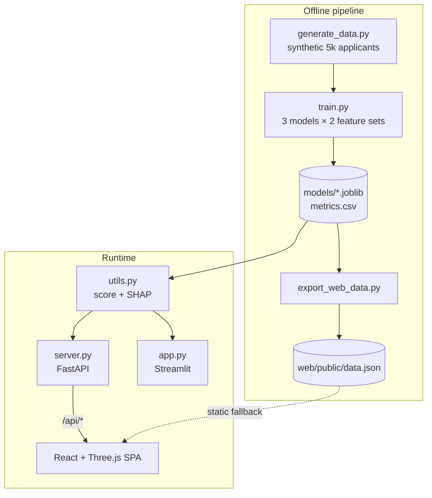
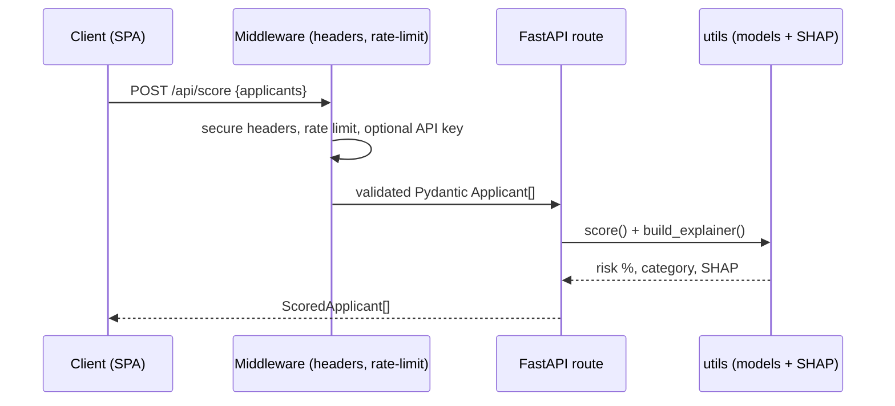

# Architecture

Credit Risk Decision Engine — one modeling core served three ways: a live REST
API, an interactive 3D web app, and a Streamlit analyst app. File-based data
layer (CSV + joblib); no database.

## System overview

## Modules

| Module | Responsibility |
|--------|----------------|
| `generate_data.py` | Synthetic dataset with an honest latent-risk design |
| `train.py` / `train_cv.py` | Train + evaluate models (v2 adds CV/calibration) |
| `utils.py` | **Single source** of scoring, risk bands, SHAP — imported by API + Streamlit |
| `server.py` | FastAPI: scoring, SHAP, CSV upload, metrics; security + caching |
| `export_web_data.py` | Snapshot scored batch → `web/public/data.json` |
| `app.py` | Streamlit analyst app (6 tabs) |
| `web/` | React SPA (marketing pages + 3D dashboard) |

## Key decisions
- **`utils.py` is the only scoring path** — API and Streamlit share it; no
  duplicated inference logic.
- **Static fallback** — the SPA calls `/api/*` but degrades to the bundled
  `data.json` when the backend is offline, so the site works standalone.
- **No DB** — the dataset is generated and immutable; joblib artifacts + CSV are
  sufficient and keep the deploy simple.
- **Explainability first-class** — SHAP contributions in probability space live in
  `utils.build_explainer`, reused everywhere.

## Request flow (score)

See also: [MLPipeline.md](MLPipeline.md), [API.md](API.md),
[SECURITY_REPORT.md](SECURITY_REPORT.md), [PERFORMANCE_REPORT.md](PERFORMANCE_REPORT.md).
