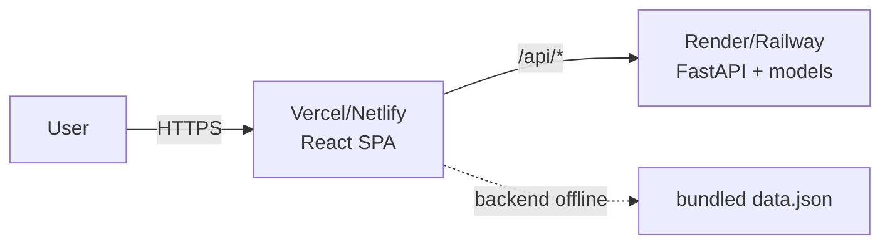

# Deployment Guide

Two independently deployable pieces: the **static frontend** (works standalone)
and the **FastAPI backend** (adds live scoring). The Streamlit app is optional.

## Topology



## Frontend → Vercel/Netlify (static)
```bash
cd web
npm ci
npm run build          # -> web/dist
```
- SPA routing: `web/vercel.json` rewrites non-asset paths to `index.html`.
- Set the API base if the backend is on another origin (proxy or `VITE_*` env).
- Works with **no backend** — falls back to `public/data.json`.

## Backend → Render/Railway (or any ASGI host)
```bash
pip install -r requirements.txt
uvicorn server:app --host 0.0.0.0 --port $PORT
```
Required env (see [`.env.example`](../.env.example)):
- `CR_SECRET_KEY` — signs session tokens. **Must set in prod** (a random key is
  generated otherwise, signing everyone out on each restart/replica).
- `CR_DATABASE_URL` — audit trail + accounts. SQLite by default; use Postgres for
  more than one replica. In Docker it points at the `api-data` volume so the
  audit trail survives container replacement.
- `CR_TOKEN_TTL` — session lifetime in seconds (default 8 h).
- `CR_ALLOWED_ORIGINS` — the deployed frontend origin(s). **Must set in prod.**
- `CR_API_KEY` — optional extra `X-API-Key` gate on scoring routes.

**First run.** The first account created becomes a manager (someone has to be
able to appoint the others); every later sign-up is an analyst until a manager
promotes them under **Team**.
- `CR_RATE_LIMIT_PER_MIN`, `CR_MAX_UPLOAD_BYTES`, `CR_MAX_ROWS`, `CR_LOG_LEVEL`.

The trained `models/` and `data/applicants.csv` must ship with the backend
(they're loaded on first request and cached).

## Health check
`GET /api/health` → `200 {"status":"ok"}`. Wire it as the platform health probe.

## Notes
- Terminate TLS at the platform/proxy (the app speaks plain HTTP).
- Rate limiter is per-process — for multiple instances use an edge limiter or
  a shared store.
- See [DEVELOPER_GUIDE.md](DEVELOPER_GUIDE.md) for local run,
  [TROUBLESHOOTING.md](TROUBLESHOOTING.md) for common issues.
