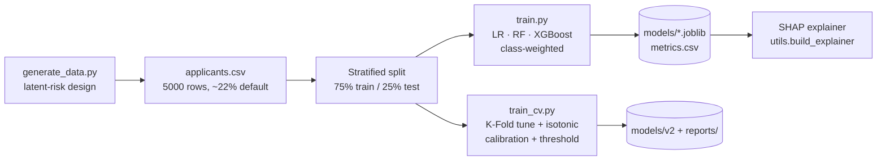

# ML Pipeline

## Flow



## Dataset (synthetic, honest by design)
A latent "true creditworthiness" depends on both traditional (income, DTI) and
behavioral (payment consistency, income volatility, debt trend) drivers.
`default` is sampled from that latent state — **not** the observed features — and
traditional signals are deliberately **noisy proxies**, noisiest for thin-file
borrowers. The model must recover the behavioral signal, so its gain is earned.

## Feature sets
- **Traditional:** credit_score, income, existing_debt, loan_amount
- **Traditional + Behavioral:** + payment_consistency_pct, income_volatility_score, debt_trend

## Modeling
- Logistic Regression, Random Forest, XGBoost.
- **Imbalance:** class weighting / `scale_pos_weight` (not SMOTE).
- **Leakage control:** scaling inside a `Pipeline`, fit on train only.
- **Metric:** AUC-PR (headline) + precision/recall/F1; accuracy omitted (rare class).

## Headline result
Adding behavioral features lifts best-model **AUC-PR 0.52 → 0.67** (test set),
concentrated among thin-file applicants — the *decision-flip* effect.

## Improved pipeline (Phase 3, staged)
`train_cv.py` adds Stratified 5-fold CV + grid tuning, an untouched test set, a
validation split for threshold selection, isotonic **calibration**, and an
**F1-optimized threshold**. Discrimination is unchanged (already near ceiling);
the gain is trustworthy probabilities + rigor. Full comparison in
[ML_REPORT.md](ML_REPORT.md); figures in `reports/figures/`.

## Explainability
`utils.build_explainer` returns probability-space SHAP (a contribution reads as
"+12% risk"): `TreeExplainer` for tree models, model-agnostic for the linear
pipeline. Additivity is asserted in tests.

## Reproduce
```bash
python3 generate_data.py && python3 train.py      # production artifacts
python3 train_cv.py && python3 evaluate.py         # improved + figures
```
